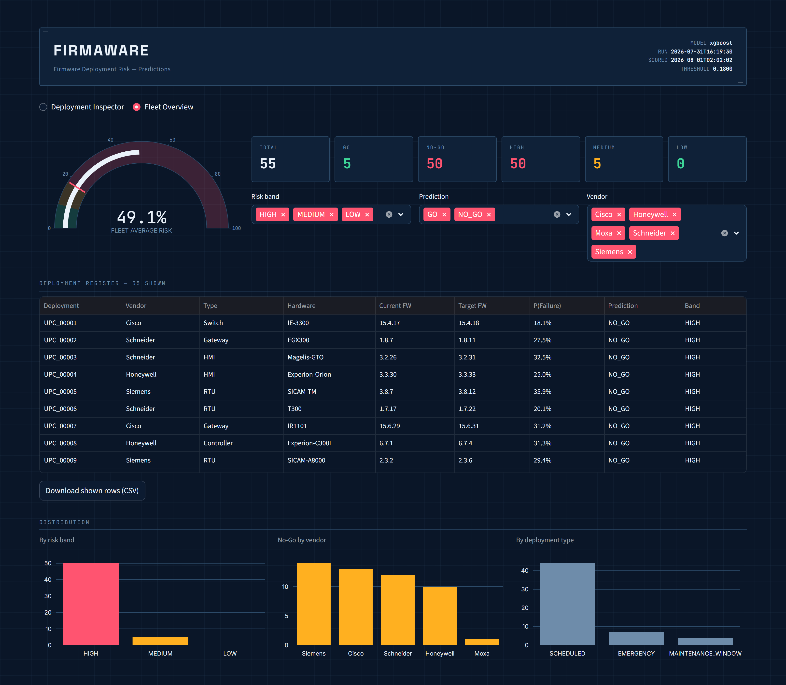
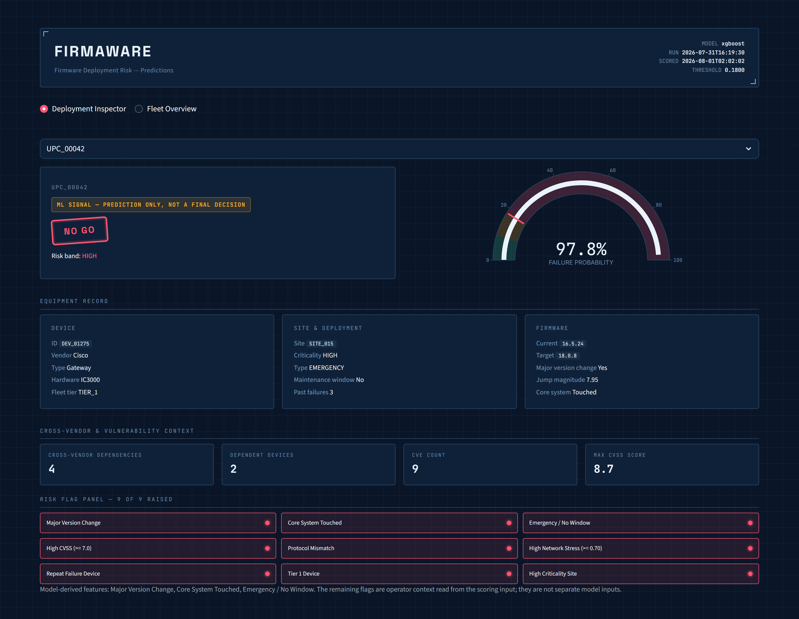
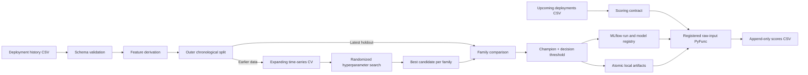
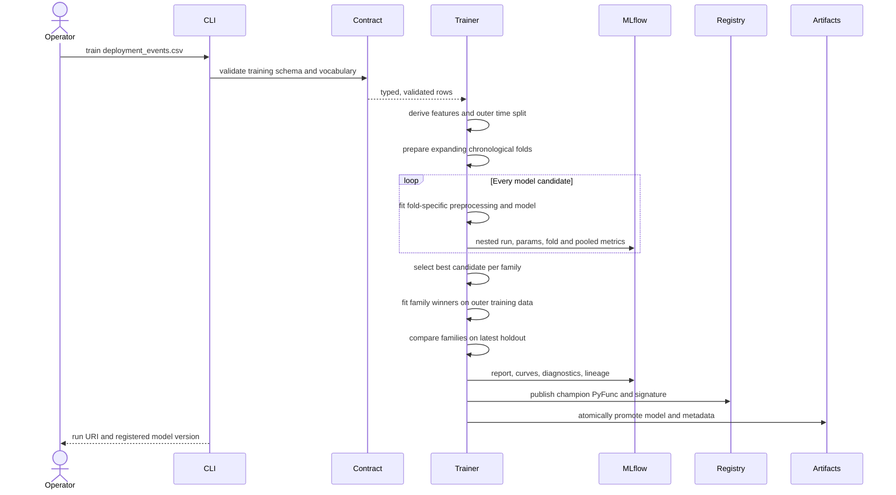
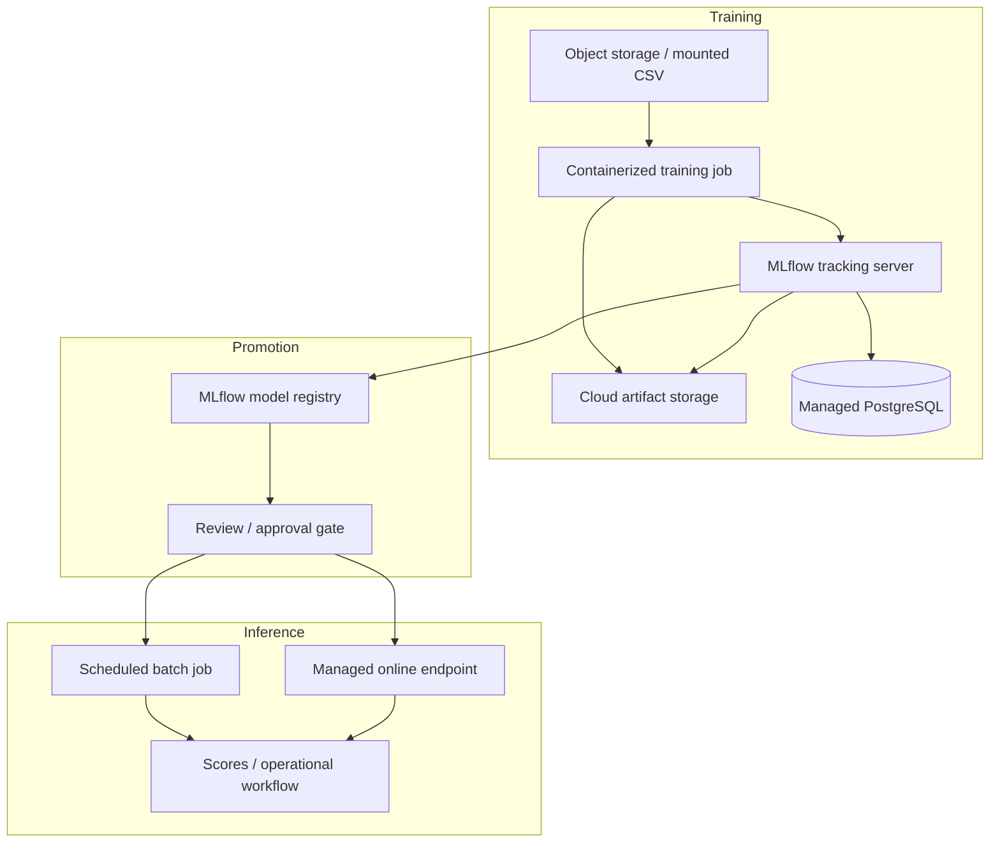
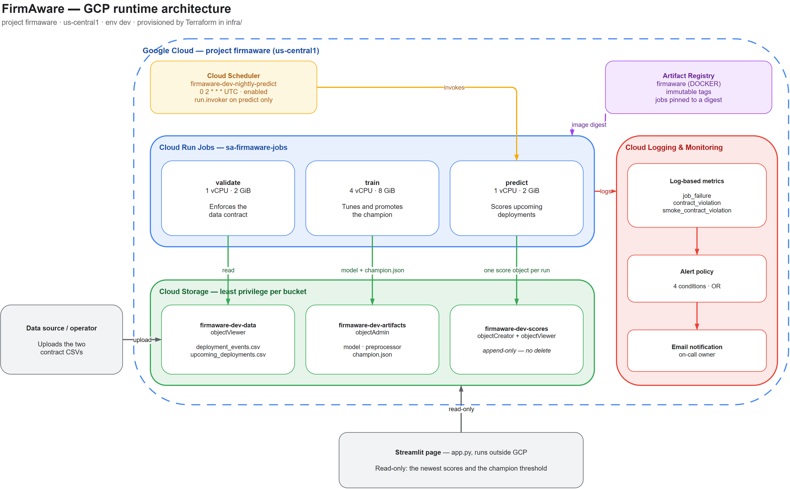
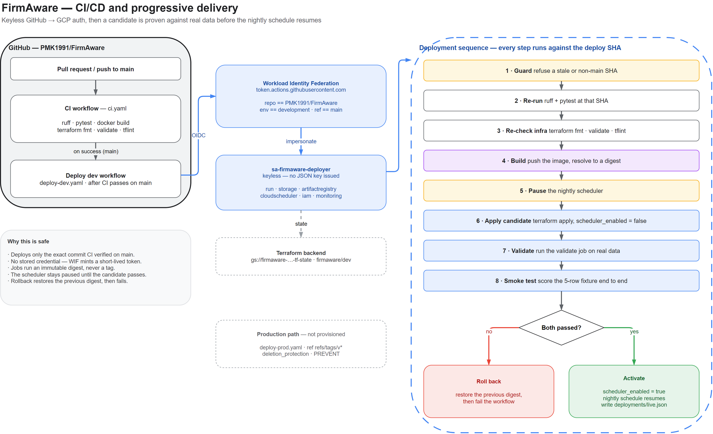

# FirmAware

FirmAware is a deterministic firmware deployment-risk pipeline with
time-aware hyperparameter tuning, detailed MLflow experiment tracking, model
registry publication, and a raw-input model package that can be served locally
or moved to Azure ML and GCP.

**Live demo: [firmaware.streamlit.app](https://firmaware.streamlit.app/)** — the
read-only page at the end of the pipeline. It renders an already-scored run and
never trains, scores, or writes anything. The hosted copy reads a committed
sample run; pointed at the buckets it reads the live one.



*Fleet Overview — the whole scored run at once: headline counts, band, decision,
and vendor filters, the register, and distributions. The gauge shows fleet average
risk against the same threshold marker used per deployment.*



*Deployment Inspector — one deployment in full. The stamp carries the GO/NO_GO
decision and risk band, the gauge places its failure probability against the
threshold, and the flag panel reports how many of the nine risk conditions are
raised.*

Both screenshots are of the live GCP environment: `xgboost` champion run
`2026-07-31T16:19:30`, threshold `0.1800`, scoring the run the nightly Cloud
Scheduler job produced unattended at `2026-08-01T02:02:02`. The rest of this file
follows the same order the pipeline runs in: what the decision is, how the system
is designed, how to run it, how it reaches the cloud, and how it is displayed.

The GCP batch deployment, Terraform modules, keyless CI/CD, smoke tests, and
rollback runbook are documented in [`infra/README.md`](infra/README.md).
The exploratory-to-deployment notebook workflow is documented in
[`notebooks/README.md`](notebooks/README.md).

## Project context

Firmware deployment failures can make devices unavailable, force rollback, or
degrade a site after rollout. Release teams therefore need a repeatable risk
signal before approving a deployment, but that signal must not learn from
post-deployment facts or silently change when source-system vocabularies drift.

FirmAware is a clean-room implementation of that decision stage. It converts
historical deployment outcomes into a binary operational decision:

| Output | Meaning |
|---|---|
| `GO` | Predicted risk is below the persisted decision threshold. |
| `NO_GO` | Predicted risk is at or above the threshold and should be reviewed. |
| `LOW` | Probability is below half the threshold. |
| `MEDIUM` | Probability is between half the threshold and the threshold. |
| `HIGH` | Probability is at or above the threshold. |

The decision line optimizes business cost rather than accuracy alone. A missed
risky deployment is five times as expensive as a false alarm by default:

```text
expected_cost = false_negatives * cost_ratio_fn_fp + false_positives
```

The threshold, `GO`/`NO_GO` result, and bands all derive from this one persisted
decision line. This keeps model evaluation, local batch prediction, and hosted
MLflow inference consistent.

### Intended users

- **Release and fleet operations:** review deployment risk before rollout.
- **ML engineers:** reproduce experiments, tune models, and publish versions.
- **Platform engineers:** deploy the same MLflow model locally, on Azure ML, or
  behind a GCP-hosted MLflow serving endpoint.
- **Risk owners:** inspect cost, recall, false negatives, threshold diagnostics,
  and model lineage before approving a version.

### Goals and non-goals

| Goals | Non-goals |
|---|---|
| Enforce the source data contract before modeling | Replace release approval with a fully autonomous action |
| Prevent identifier, date, and post-outcome leakage | Stream processing or database ingestion |
| Preserve chronology during tuning and evaluation | Real-time feature stores |
| Make every run deterministic and traceable | Large distributed search clusters |
| Package preprocessing and decisions with the model | Drift monitoring or automated retraining |
| Support local development and cloud handoff | Provider-specific orchestration code |

## ML pipeline system design

### High-level architecture



The system has one preprocessing implementation. Training, local prediction,
and the registered MLflow PyFunc all invoke the same feature derivation and
`Preprocessor.apply` path.

### Component responsibilities

| Component | Responsibility |
|---|---|
| `schema.py` | Defines all column facts and rejects missing columns, invalid outcomes, duplicate IDs, bad dates, and non-numeric values. |
| `features.py` | Builds signed major-version jumps and operational interaction features, labels non-success outcomes as risky, and drops identifiers/leakage fields. |
| `transform.py` | Fits train-only medians, one-hot categories, aligned feature order, and numeric scaling; reports unseen categorical values. |
| `evaluation.py` | Selects the cost-sensitive threshold and produces classification, probability, curve, confusion, and feature-importance diagnostics. |
| `train.py` | Creates time splits, searches candidates, logs nested runs, compares model families, atomically publishes local artifacts, and registers the champion. |
| `model.py` | Packages raw 27-column validation, preprocessing, scoring, OOD reporting, and decisions into a portable MLflow PyFunc. |
| `tracking.py` | Resolves local or remote MLflow tracking and artifact locations without cloud-provider coupling. |
| `predict.py` | Loads local artifacts, invokes the shared scoring path, warns on OOD values, and appends immutable score history. |
| `cli.py` | Exposes non-interactive `validate`, `train`, and `predict` commands with stable exit behavior. |

### Training and publication sequence



### Data contract and leakage boundary

Training consumes 30 columns. Scoring consumes the same contract without
`deployment_outcome`, `time_to_failure_hours`, and `rollback_required`.

- `deployment_date` controls chronology but never enters the feature matrix.
- Deployment, device, site, and fingerprint identifiers are retained only for
  validation and output correlation.
- `time_to_failure_hours` and `rollback_required` are always removed because
  they are known only after deployment.
- The target is label-agnostic after validation: every allowed non-`SUCCESS`
  outcome maps to risk `1`.
- Firmware major-version parse failures are counted; more than 1% in training
  is a hard failure.
- Unknown scoring categories remain scoreable but produce all-zero one-hot
  blocks and explicit OOD warnings.

The fitted feature list proves the leakage boundary and is persisted as
`artifacts\feature_list.json` and an MLflow artifact.

### Temporal validation and tuning

Random splitting would let later deployment behavior influence earlier
predictions. FirmAware instead uses:

1. An **outer chronological split** at the configured date or quantile.
2. **Four expanding folds** inside the earlier side. A fold's training dates
   are always earlier than its validation dates.
3. A deterministic randomized search seeded from `config.yaml`.
4. A single threshold selected from pooled out-of-time predictions for each
   candidate.
5. The lowest expected-cost candidate from each model family.
6. A latest-period holdout comparison between the tuned family winners.

The default search evaluates 12 logistic-regression candidates and 30 XGBoost
candidates. The search budget is intentionally bounded so a 20,000-row run
remains practical on a laptop while still exploring regularization, tree
complexity, learning rate, row/feature sampling, and class weighting.

### Artifacts and lineage

```text
MLflow parent run
├── child runs: one per hyperparameter candidate
├── child runs: final logistic and XGBoost holdout evaluations
├── evaluation/
│   ├── evaluation_report.html
│   ├── tuning_trials.csv
│   ├── final_model_comparison.csv
│   ├── threshold, ROC, and precision-recall data
│   ├── classification and confusion reports
│   └── feature_importance.csv
├── pipeline/
│   ├── feature_list.json
│   ├── medians.json
│   └── metadata.json
└── model: registered raw-input MLflow PyFunc
```

Local publication stages artifacts under a run-specific temporary directory.
The directory is promoted only after MLflow logging and registry publication
succeed, preventing a failed run from replacing the last usable local model.

### Scoring path

```mermaid
flowchart LR
    I[27-column request] --> C[Contract validation]
    C --> D[Feature derivation]
    D --> IM[Median imputation]
    IM --> EN[One-hot encoding + OOD report]
    EN --> AL[Align fitted feature list]
    AL --> SC[Scale numeric features]
    SC --> PR[Champion probability]
    PR --> TH[Persisted threshold]
    TH --> R[GO / NO_GO + risk band]
```



The fixed transformation order is **impute → encode → align → scale**. Alignment
occurs before scaling so a missing raw feature is filled in raw space rather
than injecting zero into standardized space.

### Deployment topology



| Concern | Local | Azure | GCP |
|---|---|---|---|
| Training compute | Python process | Azure ML command job | Vertex AI custom job, Cloud Run job, or GKE |
| Tracking | MLflow + SQLite | Azure ML MLflow endpoint | MLflow on Cloud Run/GKE |
| Metadata store | `mlflow.db` | Azure ML managed tracking | Cloud SQL for PostgreSQL |
| Artifact store | `mlruns\` | Azure-managed workspace storage | Cloud Storage |
| Registry | Local MLflow registry | Azure ML registry/workspace | MLflow registry backed by Cloud SQL |
| Serving | MLflow local server/container | Managed online or batch endpoint | Cloud Run, Vertex AI custom container, or GKE |
| Identity | Local OS user | Managed identity | Workload identity |

The provider boundary is MLflow plus environment variables. Training logic does
not import Azure or GCP SDKs, so the same container and command can move between
platforms.

### Deployed GCP architecture

The table above is the portable design. These two diagrams are the concrete
deployment live in project `firmaware` (`us-central1`, `dev`), taken from
`infra/` and `.github/workflows/`. The editable source is
[`docs/architecture/firmaware-gcp-architecture.drawio`](docs/architecture/firmaware-gcp-architecture.drawio);
re-export the PNGs whenever it changes.

Cloud Scheduler triggers the nightly `predict` job. The three Cloud Run Jobs
share one runtime identity, but each bucket grants only the roles that job
needs, and the Streamlit page sits outside GCP reading scores only.



GitHub authenticates without a stored key, then a candidate is applied with the
scheduler paused and proven against real data before the schedule resumes.



### Reliability, security, and operational controls

- **Determinism:** every candidate and stochastic model uses the configured
  seed; XGBoost uses one worker to avoid nondeterministic parallel reductions.
- **Fail closed:** contract, split, artifact-version, and incompatible-output
  errors stop the command rather than producing success-shaped defaults.
- **Reproducibility:** code, dependencies, model signature, parameters,
  thresholds, metrics, date ranges, and model URI are logged together.
- **Privacy:** row-level evaluation artifacts are opt-in, model examples are
  synthetic, and tracking URI credentials/query parameters are not persisted.
- **Portability:** the model, preprocessor, and metadata are embedded in the
  PyFunc rather than referring to Windows-only artifact paths.
- **Backward safety:** scoring rejects mismatched spec versions and never
  overwrites score history.
- **OOD visibility:** unseen categories are flagged per row instead of silently
  aliasing a known category.

### Current limits and production evolution

This repository intentionally remains a small pipeline rather than a complete
MLOps platform. A production program should add:

- An orchestrator for schedules, retries, data arrival, and approval workflows.
- Data quality history and drift/performance monitoring after outcomes mature.
- A concurrency-safe output sink instead of append-only CSV for parallel jobs.
- Managed secrets, endpoint authentication, network isolation, and audit policy.
- Registry aliases or stages such as `candidate` and `champion` with explicit
  promotion criteria.
- Load, latency, resilience, and rollback tests for the selected serving target.

## Setup

Python 3.11 or newer is required. From the project root:

```powershell
python -m venv .venv
.\.venv\Scripts\Activate.ps1
python -m pip install -e ".[train]"
```

The base install carries only the schema, feature and IO modules. Modelling
lives behind the `train` extra, the read-only page behind `app`, and tooling
behind `dev`; use `".[dev,app,train]"` to work on the whole repository. The
split is what keeps the hosted page off scikit-learn, xgboost and MLflow, which
it never calls: 402 MB over 55 packages rather than 855 MB over 114.

Place `deployment_events.csv` and `upcoming_deployments.csv` in `data\`.
Training input has the 30-column schema in the specification. Scoring input
omits `deployment_outcome`, `time_to_failure_hours`, and `rollback_required`.

## Quickstart

```powershell
python -m firmaware validate --input data\deployment_events.csv --mode training
python -m firmaware train --input data\deployment_events.csv --config config.yaml
python -m firmaware predict --input data\upcoming_deployments.csv
```

The default training run creates `mlflow.db`, stores MLflow artifacts in
`mlruns\`, registers the champion as `FirmAwareRiskModel`, and atomically
publishes the latest local batch artifacts under `artifacts\`.

Open the experiment UI:

```powershell
mlflow ui --backend-store-uri sqlite:///mlflow.db --port 5000
```

The run and registered-model URIs are printed after training and persisted in
`artifacts\metadata.json`.

## Tuning and evaluation design

FirmAware uses strict chronological model selection:

1. The outer split reserves the latest data as the family-selection holdout.
2. The earlier side becomes four expanding time folds. Every fold trains only
   on dates earlier than its validation dates.
3. Every configured logistic-regression and XGBoost candidate runs across all
   folds as one nested MLflow trial.
4. Hyperparameters and one cost-sensitive threshold are selected from pooled
   out-of-time predictions, with ROC-AUC as the tie-breaker.
5. The best candidate from each family is trained on the full outer training
   side. The holdout expected-cost comparison chooses the published family,
   matching the FirmAware champion contract.

The default deterministic randomized search evaluates 12 logistic and 30
XGBoost candidates. It covers logistic regularization/class weighting plus
XGBoost depth, estimators, learning rate, child weight, row/feature sampling,
gamma, and L1/L2 regularization. Edit `tuning.search_spaces` and
`tuning.max_candidates` to change the budget. Set `tuning.strategy: grid` for
exhaustive enumeration or `tuning.enabled: false` for the single parameter sets
under `models`.

The parent MLflow run includes:

- Accuracy, precision, recall, specificity, F1, ROC-AUC, average precision,
  Brier score, log loss, confusion counts, false-positive/negative rates, and
  cost-weighted expected cost.
- Nested tuning and final-family runs with parameters, thresholds, and metrics.
- `evaluation_report.html`, all tuning results, final model comparison,
  confusion matrix, classification report, threshold diagnostics, ROC and
  precision-recall curve data, and feature importance.
- The fitted raw-input PyFunc model, explicit nullable-numeric signature,
  dependency versions, source package, input example, and registry version.

Row-level test predictions are disabled by default to avoid publishing
deployment identifiers. Set `mlflow.log_row_level_artifacts: true` only when
the tracking server has the appropriate access controls. The model input
example is synthetic and tracking URIs are redacted before metadata is logged.

## Serving the registered model

The MLflow model accepts the same 27 columns as
`upcoming_deployments.csv`. Validation, feature derivation, imputation,
encoding, scaling, OOD reporting, probability scoring, and decision generation
are included in one PyFunc package.

Numeric columns are nullable, so the serving signature types every one of them
as `double`. MLflow enforces that signature before the model runs and will not
cast `int64` to `double`, so send numerics as floats: a frame built from whole
numbers types them `int64` on Linux, which is rejected. The batch `predict`
path is unaffected because it validates and casts internally.

```python
frame = frame.astype({column: "float64" for column in NUMERIC_COLUMNS})
```

```powershell
$version = "<registered-version>"
mlflow models serve -m "models:/FirmAwareRiskModel/$version" -p 5001 --env-manager local
```

Build a portable Linux container when the target platform expects a custom
image:

```powershell
$version = "<registered-version>"
mlflow models build-docker -m "models:/FirmAwareRiskModel/$version" -n firmaware-model
```

## Azure ML and GCP

Standard MLflow environment variables can redirect experiment tracking:

```powershell
$env:MLFLOW_TRACKING_URI = "https://your-mlflow-tracking-endpoint"
$env:MLFLOW_EXPERIMENT_NAME = "firmaware-production"
$env:FIRMAWARE_REGISTERED_MODEL_NAME = "FirmAwareRiskModel"
python -m firmaware train --input data\deployment_events.csv --config config.yaml
```

For **Azure ML**, install `azureml-mlflow` in the Azure job image and set
`MLFLOW_TRACKING_URI` to the workspace MLflow tracking URI. Azure identity
supplies authentication; the run, artifacts, and registered PyFunc model are
published to the workspace.

For **GCP batch deployment**, FirmAware lazily imports `google-cloud-storage`
only for `gs://` URIs. Cloud Run Jobs read inputs from GCS, publish immutable
model runs plus `champion.json`, and create one new score object per execution.
The Cloud deployment intentionally has no MLflow server: GCS metadata is its
system of record, while the local SQLite MLflow store remains available for
development. See [`infra/README.md`](infra/README.md) and the
[deployed GCP architecture diagrams](#deployed-gcp-architecture).

When tracking through a remote HTTP or managed endpoint, FirmAware leaves
artifact routing to the server unless an explicit cloud artifact URI is set.
Standard MLflow authentication variables remain outside config and metadata.

## Local batch output

Prediction uses the persisted champion and pooled-CV-selected threshold, then
appends rows to `outputs\scores.csv`. Unknown categorical values are encoded as
all-zero one-hot blocks and printed as prominent warnings while still being
scored. Existing score history is never overwritten.

## Predictions page

`app.py` is a read-only Streamlit page over scores the pipeline has already
written. It never trains, scores, or writes anything, so it is safe to point at
a live environment.

```powershell
python -m pip install -e ".[app]"
python -m firmaware predict
streamlit run app.py
```

It reads the same environment contract as the pipeline, so the identical command
serves cloud output:

```powershell
$env:FIRMAWARE_SCORES_URI = "gs://firmaware-dev-scores/scores"
$env:FIRMAWARE_ARTIFACTS_URI = "gs://firmaware-dev-artifacts"
$env:FIRMAWARE_DATA_URI = "gs://firmaware-dev-data"
streamlit run app.py
```

Two views share one scored dataset. **Fleet Overview** ranks the register with
filters, a fleet-average gauge, and band, decision, and tier distributions.
**Deployment Inspector** shows one deployment's GO/NO_GO stamp, probability
gauge, equipment attributes, and risk flags.

Both views are pictured at the [top of this file](#firmaware) and running at
[firmaware.streamlit.app](https://firmaware.streamlit.app/).

The flag panel always states its count as `N of 9 raised`. Roughly a third of
deployments legitimately raise nothing, and those rows cluster early in the
identifier order, so an all-clear panel is labeled as a result rather than left
looking like a failed render.

The page imports `firmaware.schema`, `firmaware.features`, and `firmaware.io`
rather than restating them, and it reads the decision threshold from the
champion's `metadata.json`. Gauge zones are therefore derived from the live
threshold instead of fixed cut points, so the display cannot drift from
`model.score_dataframe`. When several scoring runs exist, the newest is shown and
a sidebar selector exposes the earlier immutable objects. Flags the model
consumes are labeled separately from operator context that only annotates a
deployment.

### Hosted demo on Streamlit Community Cloud

[firmaware.streamlit.app](https://firmaware.streamlit.app/) serves this page from
`feature/mlflow-pipeline`. When nothing is configured and the pipeline has not
run in the checkout, the page falls back to the fixtures in `demo/`: one scored
run, the upcoming batch behind it, and the champion's `metadata.json`, 28 KB in
total. A bare clone therefore renders, which is exactly what Community Cloud
serves.

Deploy from [share.streamlit.io](https://share.streamlit.io):

| Field | Value |
| --- | --- |
| Repository | `PMK1991/FirmAware` |
| Branch | `main`, or whichever branch you are deploying |
| Main file path | `app.py` |
| Python version, under Advanced settings | `3.13` |

`requirements.txt` installs `.[app]`, which carries the page and none of the
training stack, so the build stays at 402 MB over 55 packages instead of 855 MB
over 114.

Set the interpreter explicitly. Community Cloud now defaults to 3.14, and
Streamlit's own `pyarrow` dependency publishes no 3.14 wheel, so the builder
tries to compile Arrow from source without a toolchain and the deploy fails
with "Error installing requirements". No pin in this repository can fix a wheel
that does not exist, and the version cannot be changed after the fact: an app
already on 3.14 has to be deleted and redeployed. The install and a full render
are verified on 3.13.

The hosted demo reads those committed fixtures rather than the live buckets.
Community Cloud cannot federate a GCP identity, and issuing a service account key
to give it one would break the keyless guarantee the deployment is built on. It
also serves `*.streamlit.app` only, so a custom domain still needs the Cloud Run
path described under [Deployment topology](#deployment-topology).

## Decisions where the specification was silent

| Decision | Implementation |
|---|---|
| Quantile boundary with repeated dates | The boundary date starts the later side; all rows on that date move together so chronology is strict. |
| Threshold cost tie | Keep the first threshold in the ascending `0.01`–`0.99` sweep. |
| Complete tuning tie | Prefer higher ROC-AUC, then logistic regression and deterministic parameter JSON order. |
| Calibration slice | Use the latest 20% of the relevant training side and require at least 20 rows plus both classes. |
| Entirely missing training numeric column | Fail clearly because no train-fitted median exists. |
| Decision precision | Apply the threshold to the unrounded probability, then serialize the reported probability to exactly four decimal places. |
| Existing incompatible scores file | Fail rather than overwrite or append under a mismatched header. |
| Local artifact publication | Stage by MLflow run ID and promote only after tracking and registry publication succeed. |

Class weighting is optional in the logistic search despite the near-balanced
source classes. The final shipped family winner is not retrained after its
holdout comparison.

## Tests

```powershell
python -m pytest -q
```

Verified output on 2026-08-01:

```text
33 passed in 47.59s
```

The suite covers the data contract, label behavior, signed version features,
persisted transform parity, OOD encoding, strict outer and rolling time splits,
deterministic metrics, leakage exclusion, append-only output, MLflow nested
tracking, registry publication, detailed evaluation artifacts, hosted/local
prediction parity, hosted inference with nullable numeric values, lazy GCS I/O,
immutable model runs, champion digest verification, environment-driven CLI
defaults, one-object-per-run cloud scoring, run listing order across both
stores, and the predictions page in both views, including its threshold-derived
gauge zones, run selection, missing-scores handling, and read-only behavior.
